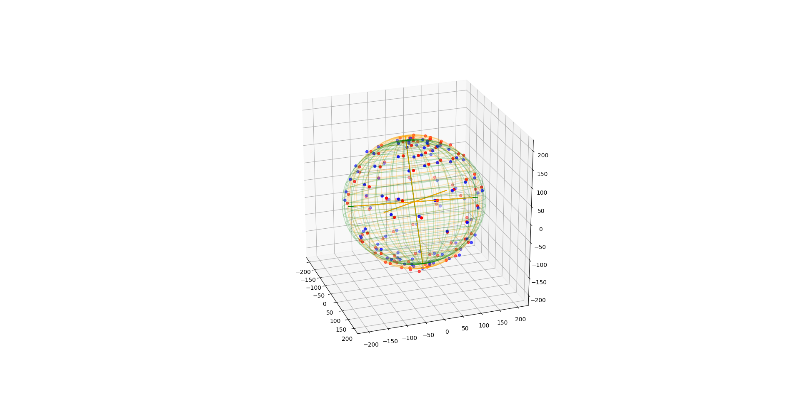

# Ellipsoid fit python
Find ellipsoid fit for arbitrary data with python/numpy, plot it or write to file.
(Should work on both python 2.7 and python 3)

Used for 3-axis magnetometer calibration.

Project is a port of matlab/octave http://www.mathworks.com/matlabcentral/fileexchange/24693-ellipsoid-fit to python/numpy
with some data regularization and fancy plotting on matplotlib added. It utilizes minimum squares method.
Some code for plotting taken from https://github.com/minillinim/ellipsoid

Example input file is mag_out.txt and consists of rows with 3 numbers representing point coordinates.

Use plot_ellipsoid.py to see input data, fitted ellipsoid and data transferred onto sphere surface.

Use get_calibration_ellipsoid.py to generate magcal_ellipsoid.txt where first row has coordinates of fitted ellipsoid center, and other
three rows are ellipsoid axes.

Requirements are:
- numpy
- matplotlib for plotting
